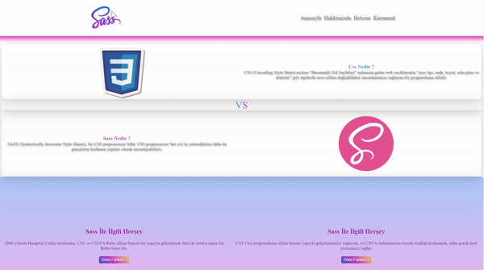

<h1> SASS PROJE </h1>

Bu web sitesi, SASS'ın temel özelliklerini ve kullanımını açıklayarak kullanıcılara rehberlik etmek için tasarlanmıştır. 

<h2> Bölümler </h2>

<ul>
<li>Css Nedir ? 

<li>Sass Nedir ?

<li>Sass Ile Ilgili Hersey 

<li>Kayıt Ol</li>
</ul>

<h2>Kullanılan Teknolojiler </h2>

<ul>
<li> HTML </li>
<li> CSS </li>
<li> SASS </li>
<li> Bootstrap</li>
</ul> 

<h2>Ekran Görüntüsü</h2>

